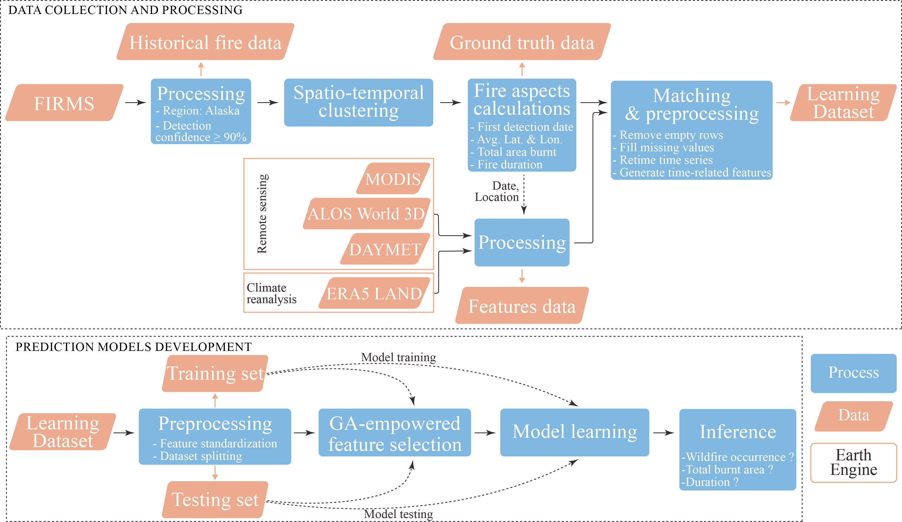

# Wildfires
This repository contains the data, code, and metadata for the research paper titled **"Alaska Wildfire Prediction using Geospatial Features and Machine Learning."** This project aims to enhance the accuracy of wildfire occurrence and behavior prediction models by leveraging NASA's FIRMS dataset (for historical wildfire events) and both temporal and geospatial data (+50 features). The proposed framework integrates machine learning algorithms and feature selection techniques to improve wildfire management and response efforts.

## Repository Structure
- `Data/` - Contains the datasets used in the study as well as the proposed model predictions, including:
  - `Fire_archive_AlaskaOnly.csv` - Alaska-filtered NASA FIRMS wildfire data.
  - `InterAgencyFirePerimeterHistory_All_Years_View.shp` - Shapefile of historical fire perimeters (due to space limitations, please download from: https://data-nifc.opendata.arcgis.com/datasets/nifc::interagencyfireperimeterhistory-all-years-view/about).
- `Code/` - Contains Python and MATLAB scripts for data acquisition, preprocessing, analysis, and visualization.
- `Maps/` - Contains GEOTIFF files of all the maps used in the manuscript.
- `Metadata/` - Contains metadata file adhering to USGS and ISO-compliant standards.
- `README.md` - Overview and instructions for using the repository.
- `LICENSE` - License information for the repository.

## Data
### FIRMS Dataset
- Source: NASA FIRMS Project
- Spatial Resolution: Various
- Temporal Coverage: 2000-2022
- Description: Contains geospatial, temporal, and atmospheric information on wildfire events.
- [Metadata](Metadata/FIRMS_metadata.xml) - See detailed metadata for this dataset.

## Code
### TemporalSpatialClustering.ipynb
- **Description**: A Jupyter notebook for performing temporal and spatial clustering on raw wildfire detected events.
- **Dependencies**: Python 3.x, scikit-learn, pandas, geopandas
- **Input**: `Fire_archive_AlaskaOnly.csv`
- **Output**: Clustering results and visualizations.

### Fire_clustering_preprocessingV2.m
- **Description**: (Optional) A MATLAB script for preprocessing data and performing spatio-temporal clustering on the raw wildfire detected events.
- **Dependencies**: MATLAB R2024a or later
- **Input**: Wildfire event data in Shapefile or CSV format
- **Output**: Preprocessed data and clustering results.

### FireForecastingv2-datacollection.ipynb
- **Description**: A Jupyter notebook for collecting and preprocessing geospatial data for wildfire prediction.
- **Dependencies**: Python 3.x, numpy, pandas, geopandas
- **Input**: Various geospatial datasets
- **Output**: Preprocessed data ready for modeling.

### FIRES_statisticalAnalysis.ipynb
- **Description**: A Jupyter notebook for performing statistical analysis on the features contained in the wildfire dataset.
- **Dependencies**: Python 3.x, pandas, seaborn, matplotlib
- **Input**: Preprocessed wildfire dataset
- **Output**: Statistical analysis results and figures.

### FireForecastingv2-featureSelection.ipynb
- **Description**: A Jupyter notebook for performing the sequential GA optimization that selects the most relevant features for each wildfire occurrence and behavior prediction task.
- **Dependencies**: Python 3.x, scikit-learn, DEAP (Genetic Algorithms)
- **Input**: Wildfire dataset with features
- **Output**: Selected features for model training.

### FireForecastingv2-negClass.ipynb
- **Description**: A Jupyter notebook focusing on handling negative class samples in wildfire occurrence detection.
- **Dependencies**: Python 3.x, numpy, pandas
- **Input**: Wildfire dataset with labeled classes
- **Output**: Dataset with balanced classes.

### FireForecastingv2_modelLearningV4.ipynb
- **Description**: A Jupyter notebook for training and evaluating wildfire occurrence and behavior prediction models.
- **Dependencies**: Python 3.x, scikit-learn, tsai (for deep learning models)
- **Input**: Feature-selected wildfire dataset
- **Output**: Trained models and evaluation metrics.

### Fires_Baselines.m
- **Description**: A MATLAB script that implements baseline models for comparison in wildfire occurrence and behavior prediction.
- **Dependencies**: MATLAB R2024a or later
- **Input**: Wildfire dataset
- **Output**: Baseline model performance metrics.

### Figures_results.m
- **Description**: A MATLAB script for generating figures to visualize the wildfire prediction results.
- **Dependencies**: MATLAB R2024a or later
- **Input**: Prediction results from various models
- **Output**: Figures for visual analysis.

## Metadata Standards
The metadata file in the `Metadata/` directory adhere to USGS and ISO-compliant standards, ensuring comprehensive documentation of the datasets, including data sources, spatial and temporal coverage, variable descriptions, and usage constraints.

## License
This repository is licensed under the [MIT License](LICENSE).

## FAIR Principles Compliance
This repository follows the FAIR principles to ensure that the data and code are:
- **Findable**: Clearly organized and documented, with easy access via this public GitHub repository.
- **Accessible**: All data and code are openly accessible, with detailed instructions provided in the README and metadata files.
- **Interoperable**: Data formats such as CSV and GeoTIFF are widely used and can be easily integrated into various data processing and learning tools.
- **Reusable**: The project is licensed under the MIT License, ensuring that the data and code can be reused by the scientific community for further research and development.
